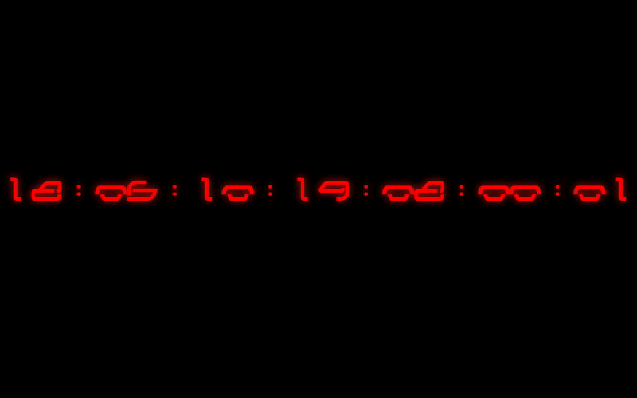

# Time Leap Clock
A macOS screen saver that displays a clock like the movie "時をかける少女 (The Girl Who Leapt Through Time)".

## Installation
0. Download the latest release from the [releases page](https://github.com/hoto17296/TimeLeapClock/releases) and unzip it.
0. Double click the `timeleap100.ttf` file to install font to your computer.
0. Double click the `TimeLeapClock.saver` file to install screen saver.

## LICENSE
- Font file `timeleap100.ttf` is licensed under a [Creative Commons Attribution 2.1 Japan](https://creativecommons.org/licenses/by/2.1/jp/) License.
  - [kironono (Junichi Kakisako)](http://kironono.com)
  - [時をかける少女 デザインフォント「TimeLeap」 - Ola Kae Tode Tai](http://ola.kironono.com/entry/fonts-timeleap)
- Other files are licensed under [CC0](https://creativecommons.org/publicdomain/zero/1.0/deed.ja).
